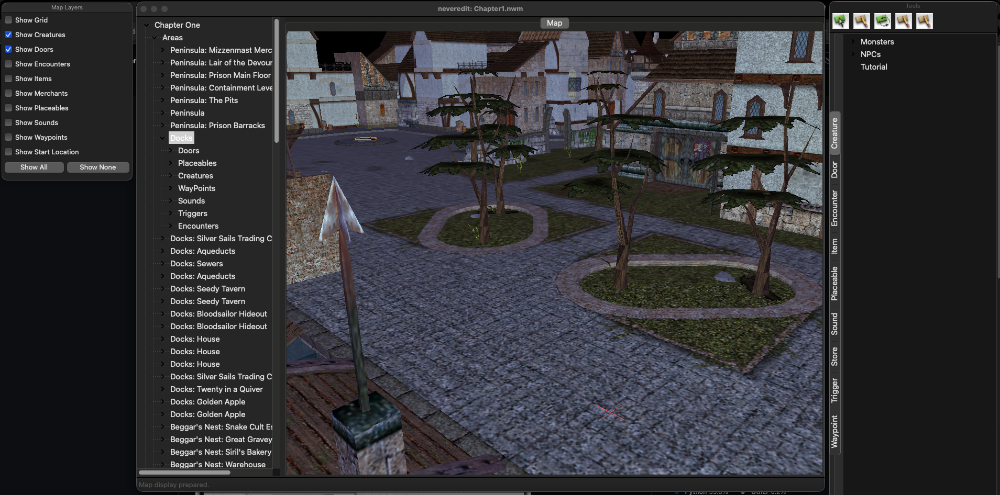

# neveredit

Update: 3/8/2026
I've successfully updated the code to Python3. NWM/MODs currently load, 3d mapping is functional but needs improvement.
I kept wxPython for the interface and have tested only on MacOS and Debian with KDE. Currently working on rendering fidelity/parity with NWN:EE. The primary goal for this project is to provide a much needed NWN Toolset for those who are on Linux/MacOS. 

I want to expand functionality over time and possibly add features not currently implemented. 

Original readme.md:
This is an import of an old sourceforge project. Neveredit is an editor for Bioware's Neverwinter Nights game. 

It also includes all the low level libraries and a command line tool to read and write the binary format files that the game uses.

I have no idea whether you can still get the actual editor to run, but I wanted to make the code more easily available. I suspect it wouldn't
be hard to get the libraries and command line tool to run.

Note that this used an external open source Neverwinter Nights script compiler written in C - not included here.

